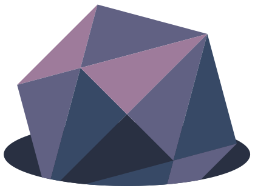

# WICBW Wiki

A documentation site to host notes and stories for our home tabletop game.

## 📚 Storytellers welcome

This is a creative space for anyone involved with the game. Have an interesting character idea or story to add? Let's work together to add it! I enjoy creative writing and weaving in threads created from other minds, especially when it can have consequences for the characters involved.

## 🧞 Commands

All commands are run from the root of the project, from a terminal:

| Command                   | Action                                           |
| :------------------------ | :----------------------------------------------- |
| `npm install`             | Installs dependencies                            |
| `npm run dev`             | Starts local dev server at `localhost:4321`      |
| `npm run build`           | Build your production site to `./dist/`          |
| `npm run preview`         | Preview your build locally, before deploying     |
| `npm run astro ...`       | Run CLI commands like `astro add`, `astro check` |
| `npm run astro -- --help` | Get help using the Astro CLI                     |